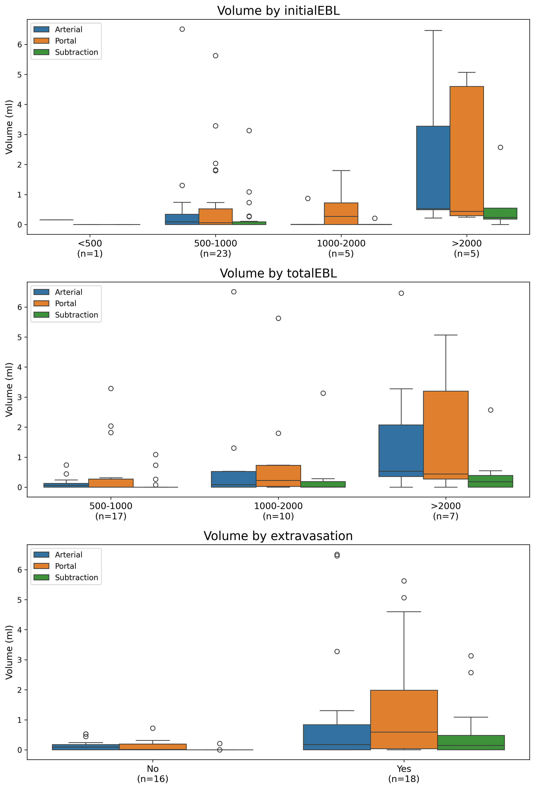

# Simplified Postpartum Hemorrhage Quantification Tool

## Overview

This Python project provides a simplified yet effective approach to automated quantification of postpartum hemorrhage from **multi-phase CT series** (arterial, portal, and derived subtraction phase). The tool uses TotalSegmentator for anatomical exclusion to create a common uterine mask and applies Hounsfield Unit (HU) thresholding for hemorrhage detection.

## Methodology

The tool implements a straightforward multi-phase analysis approach:

1. **DICOM to NIfTI Conversion**: Converts arterial and portal phases to NIfTI format
2. **Common Anatomical Masking**: Uses TotalSegmentator to exclude non-uterine structures for both phases, then creates an intersection mask
3. **Morphological Processing**: Applies hole-filling and morphological operations to the masks
4. **Multi-Phase Hemorrhage Detection**:
    - **Arterial Phase**: Detects hemorrhage using a HU threshold (e.g., >160 HU).
    - **Portal Phase**: Detects hemorrhage using a HU threshold (e.g., >180 HU).
    - **Subtraction Phase**: Creates a subtraction map (Portal - Arterial) and applies a HU threshold (e.g., >140 HU) to detect delayed extravasation.
5. **Volume Calculation**: Measures hemorrhage volumes for each phase within the common uterine region

## Installation

### Prerequisites

- Python 3.9 or higher
- CUDA-capable GPU (optional, for faster processing)

### Step 1: Clone

```bash
# If using git
git clone <repository-url>
cd pph-quantification
```

### Step 2: Install Dependencies

```bash
# Install Python dependencies
pip install -r requirements.txt
```
To use [TotalSegmentator](https://github.com/wasserth/TotalSegmentator), a license for non-commercial use is required. Please refer to the link for more information.

### Step 3: Verify Installation

```bash
# Test TotalSegmentator installation
TotalSegmentator --help

# Test the main script
python main.py --help
```

## Usage

### Batch Processing

```bash
# Process all patients in extracted_series directory
python main.py --input-dir extracted_series/ --output-dir output/
```

### Correlation Analysis

After batch processing, run the correlation analysis against clinical data:
```bash
# Ensure output/batch_summary.csv and data/PPH EV.csv exist
python correlation.py
```

### Command Line Options

**Batch Processing Script (main.py):**
- `--input-dir, -i`: Directory containing patient subdirectories with extracted series (default: "extracted_series")
- `--output-dir, -o`: Output directory for batch results (default: "output")
- `--fast`: Use fast mode for TotalSegmentator
- `--sequential`: Run processing sequentially instead of in parallel
- `--workers, -w`: Number of parallel workers to use (default: 8)

## Input Requirements

### Expected Directory Structure

After running the series extraction script, your data should be organized as:

```
extracted_series/
├── Patient001/
│   ├── Arterial/
│   │   ├── Patient001_0001.dcm
│   │   ├── Patient001_0002.dcm
│   │   └── ...
│   └── Portal/
│       ├── Patient001_0001.dcm
│       ├── Patient001_0002.dcm
│       └── ...
├── Patient002/
│   ├── Arterial/
│   └── Portal/
└── Patient003/
    ├── Arterial/
    └── Portal/
```

## Output

The tool generates simplified outputs in the specified directory:

### Files Structure

```
output/
├── Patient001/
│   ├── results.json                         # Complete analysis results
│   ├── arterial.nii.gz                      # Converted arterial phase CT  
│   ├── portal.nii.gz                        # Converted portal phase CT
│   ├── common_uterus_mask.nii.gz            # Common uterus mask (intersection)
│   ├── hemorrhage_mask_arterial.nii.gz      # Hemorrhage mask for arterial
│   ├── hemorrhage_mask_portal.nii.gz        # Hemorrhage mask for portal
│   ├── hemorrhage_mask_subtract.nii.gz      # Hemorrhage mask for subtraction
│   ├── arterial_overlay.nii.gz              # Overlay of hemorrhage on arterial CT
│   ├── portal_overlay.nii.gz                # Overlay of hemorrhage on portal CT
│   └── subtract_overlay.nii.gz              # Overlay of hemorrhage on portal CT (for subtraction)
└── Patient002/
```

### Analysis Results JSON

The simplified JSON output includes:

```json
{
  "patient_name": "Patient001",
  "processing_time": 180.5,
  "hemorrhage_volume_arterial": 185.2,
  "hemorrhage_volume_portal": 165.8,
  "hemorrhage_volume_subtract": 25.1,
  "uterus_mask_volume": 449.3
}
```

## Experimental Results

Correlation analysis was performed on a cohort of 34 patients, comparing automated hemorrhage volumes with clinical variables.



### Significant Findings

-   **Arterial Volume**:
    -   Significantly correlated with `totalEBL` (Kruskal-Wallis p=0.038).
-   **Portal Volume**:
    -   Significantly correlated with `extravasation` (Mann-Whitney U p=0.009).
-   **Subtraction Volume**:
    -   Significantly correlated with `extravasation` (Mann-Whitney U p=0.001).

### Volume Summaries by Clinical Variable

#### Initial EBL

| Category | N  | Arterial Volume (mL, mean±std) | Portal Volume (mL, mean±std) | Subtraction Volume (mL, mean±std) |
| :------- | :- | :----------------------------- | :---------------------------- | :-------------------------------- |
| 0        | 1  | 0.2                            | 0.0                           | 0.0                               |
| 1        | 23 | 0.5±1.4                        | 0.7±1.4                       | 0.2±0.7                           |
| 2        | 5  | 0.2±0.4                        | 0.6±0.8                       | 0.0±0.1                           |
| 3        | 5  | 2.2±2.7                        | 2.1±2.5                       | 0.7±1.1                           |

#### Total EBL

| Category | N  | Arterial Volume (mL, mean±std) | Portal Volume (mL, mean±std) | Subtraction Volume (mL, mean±std) |
| :------- | :- | :----------------------------- | :---------------------------- | :-------------------------------- |
| 1        | 17 | 0.1±0.2                        | 0.5±1.0                       | 0.1±0.3                           |
| 2        | 10 | 0.9±2.0                        | 0.9±1.7                       | 0.4±1.0                           |
| 3        | 7  | 1.7±2.4                        | 1.8±2.2                       | 0.5±0.9                           |

#### Extravasation

| Category | N  | Arterial Volume (mL, mean±std) | Portal Volume (mL, mean±std) | Subtraction Volume (mL, mean±std) |
| :------- | :- | :----------------------------- | :---------------------------- | :-------------------------------- |
| 0.0      | 16 | 0.1±0.2                        | 0.1±0.2                       | 0.0±0.1                           |
| 1.0      | 18 | 1.1±2.1                        | 1.5±1.9                       | 0.5±0.9                           |

**Disclaimer**: This tool is for research purposes only and is not intended for clinical diagnosis or treatment decisions
